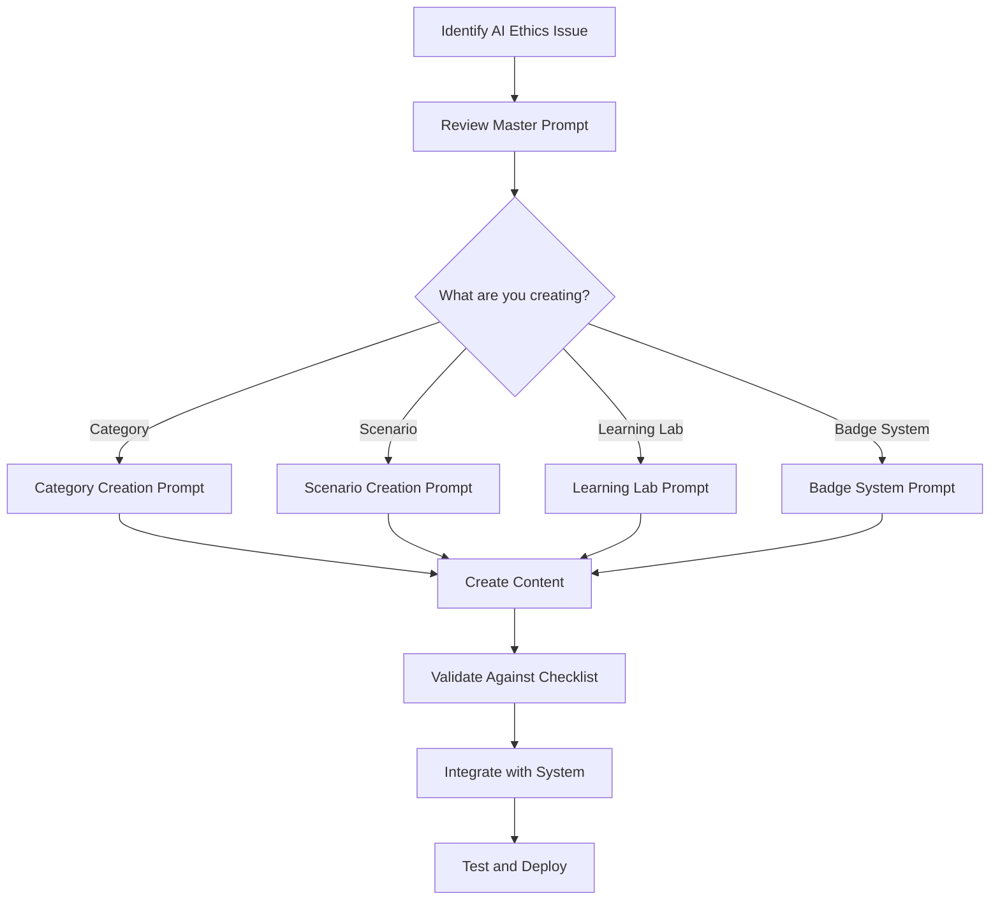

# SimulateAI Content Creation Prompts

This directory contains comprehensive prompt files for Copilot agents and content creators working
on SimulateAI. These prompts ensure consistency, quality, and alignment with our philosophical
taxonomy framework.

## 📁 Prompt Files

### 🎯 [`master-prompt.md`](./master-prompt.md)

**Primary coordination prompt** - Start here for all content creation

- System architecture overview
- Complete workflow guidance
- Quality assurance framework
- Current AI context (2025)
- Success metrics and resources

### 📚 [`category-creation-prompt.md`](./category-creation-prompt.md)

**Category development guidance** - For creating new ethical categories

- Philosophical domain mapping requirements
- Category structure and naming conventions
- AI relevance and real-world connections
- Quality checklist and validation process

### 🎭 [`scenario-creation-prompt.md`](./scenario-creation-prompt.md)

**Individual scenario design** - For creating ethical dilemmas within categories

- Scenario structure and complexity progression
- Stakeholder design and choice creation
- Ethical framework integration
- Real-world AI implementation connections

### 🧪 [`learning-lab-creation-prompt.md`](./learning-lab-creation-prompt.md)

**Interactive learning experiences** - For creating 5-phase educational labs

- Pedagogical principles and phase structure
- Activity design for each learning phase
- Adaptive content and technology integration
- Assessment and progress tracking

### 🏆 [`badge-system-creation-prompt.md`](./badge-system-creation-prompt.md)

**Achievement progression design** - For creating meaningful badge systems

- Triangular progression requirements (1, 3, 6, 10, 15, 21)
- Philosophical quote integration
- Progressive difficulty and visual design
- Community recognition and motivation

## 🎯 How to Use These Prompts

### For Copilot Agents

1. **Start with `master-prompt.md`** to understand the system architecture
2. **Choose specific prompt** based on what you're creating
3. **Follow the structure** and requirements outlined
4. **Validate against quality checklist** before finalizing
5. **Integrate with existing system** using provided guidelines

### For Human Content Creators

1. **Read master prompt** to understand philosophical framework
2. **Use specific prompts** as detailed guidance documents
3. **Reference existing categories** for implementation examples
4. **Ensure consistency** with established patterns and standards
5. **Test and validate** content before deployment

### For System Integration

1. **Follow data structures** specified in each prompt
2. **Maintain consistency** with existing category and badge schemas
3. **Ensure compatibility** with current system architecture
4. **Implement analytics** for continuous improvement tracking
5. **Update prompts** as system evolves and improves

## 🔄 Content Creation Workflow

## 📊 Quality Standards

### Philosophical Authenticity

- ✅ Accurate representation of philosophical concepts
- ✅ Proper attribution of quotes and ideas
- ✅ Meaningful connection to AI ethics challenges
- ✅ Multiple valid perspectives presented

### Educational Effectiveness

- ✅ Clear learning objectives and outcomes
- ✅ Progressive complexity and skill building
- ✅ Interactive and engaging content
- ✅ Assessment and reflection opportunities

### Technical Excellence

- ✅ Consistent data structure and formatting
- ✅ Integration with existing system architecture
- ✅ Performance optimization and accessibility
- ✅ Analytics and improvement tracking

## 🎓 Philosophical Framework Reference

Our content aligns with **10 philosophical domains**:

1. **Ethical Dilemmas** - Moral conflicts in AI systems
2. **Philosophy of Mind & Reality** - Consciousness and artificial minds
3. **Metaphysical Puzzles** - Existence and nature of AI beings
4. **Epistemological Quandaries** - AI knowledge and understanding
5. **Identity & Continuity Paradoxes** - AI identity through change
6. **Logic & Paradoxical Reasoning** - Logical contradictions in AI
7. **Free Will vs Determinism** - AI agency and choice
8. **Scientific Ethics & Technological Dilemmas** - AI research ethics
9. **Theological & Existential Puzzles** - AI purpose and meaning
10. **Political & Social Justice Dilemmas** - AI fairness and equality

## 🔧 System Integration

### Key Implementation Details

**Data Structure Patterns:**

- Categories use `title` (not `name`) and contain `scenarios[]`, `learningObjectives[]`, `tags[]`
- Scenarios use simple `dilemma`/`ethicalQuestion` structure with `options[]`
- Options have `impact{}` object with 8 ethical dimensions (-2 to +2 integer values)
- Badge system follows triangular progression (1,3,6,10,15,21) stored in localStorage

**Storage and Events:**

- Category progress: `simulateai_category_progress` localStorage key
- Badge progress: `simulateai_badge_progress` localStorage key
- Completion triggers badge checks via `BadgeManager.updateScenarioCompletion()`
- Analytics tracking through existing `AnalyticsManager` system

**File Organization:**

- Categories: `/src/data/categories.js`
- Scenarios: `/src/js/data/scenarios/[category]-scenarios.js`
- Badge config: `/src/js/data/badge-config.js`
- Impact definitions: `/src/js/data/scenario-impacts.js`

### Required Files

- `src/js/data/philosophical-taxonomy.js` - Domain definitions and mappings
- `src/data/categories.js` - Existing category implementations
- `src/js/data/badge-config.js` - Badge system configuration
- `src/js/integrations/mcp-philosophical-generator.js` - MCP integration

### Data Structure Consistency

All content must follow established object schemas for:

- Category definitions and metadata
- Scenario structure and decision points
- Learning lab phases and activities
- Badge requirements and progression

### Quality Assurance Process

1. **Philosophical Review** - Expert validation of concepts
2. **Educational Testing** - User experience and learning outcomes
3. **Technical Validation** - System integration and performance
4. **Community Feedback** - Peer review and improvement suggestions
5. **Analytics Monitoring** - Data-driven continuous improvement

## 📈 Success Metrics

### Learning Outcomes

- Improved ethical reasoning skills
- Increased AI ethics knowledge
- Enhanced critical thinking abilities
- Real-world application transfer

### Engagement Metrics

- Scenario completion rates
- Learning lab participation
- Badge achievement progression
- Community discussion activity

### System Performance

- Content quality ratings
- User satisfaction scores
- Technical performance metrics
- Continuous improvement trends

---

**Last Updated:** July 13, 2025  
**Version:** 1.0  
**Maintainer:** SimulateAI Development Team
